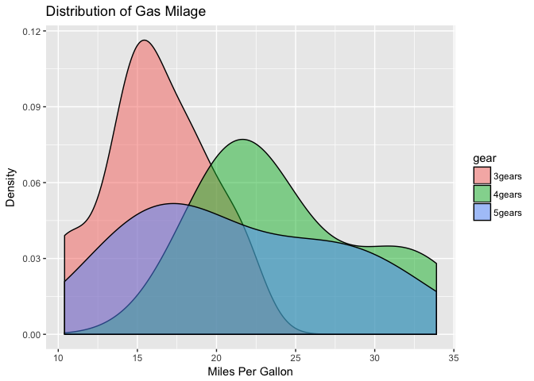
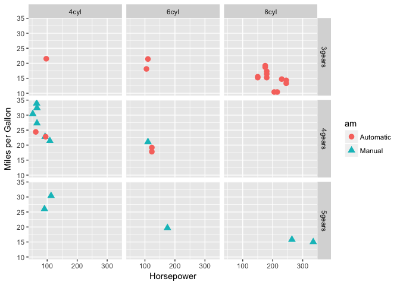
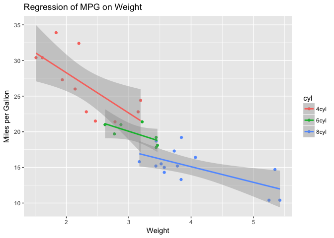
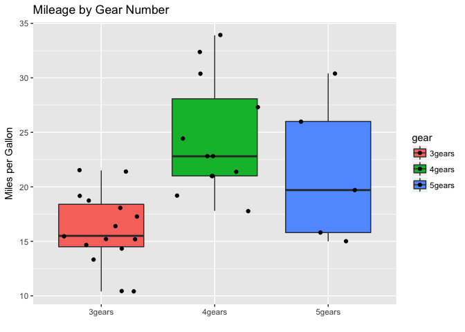

RStudio Binder test run
================
Mik Black
12 Feb 2018

Run binder container from: <https://mybinder.org/>

``` r
# ggplot2 examples
library(ggplot2)

# create factors with value labels
mtcars$gear <- factor(mtcars$gear,levels=c(3,4,5),
    labels=c("3gears","4gears","5gears"))
mtcars$am <- factor(mtcars$am,levels=c(0,1),
    labels=c("Automatic","Manual"))
mtcars$cyl <- factor(mtcars$cyl,levels=c(4,6,8),
   labels=c("4cyl","6cyl","8cyl"))

# Kernel density plots for mpg
# grouped by number of gears (indicated by color)
qplot(mpg, data=mtcars, geom="density", fill=gear, alpha=I(.5),
   main="Distribution of Gas Milage", xlab="Miles Per Gallon",
   ylab="Density")
```



``` r
# Scatterplot of mpg vs. hp for each combination of gears and cylinders
# in each facet, transmittion type is represented by shape and color
qplot(hp, mpg, data=mtcars, shape=am, color=am,
   facets=gear~cyl, size=I(3),
   xlab="Horsepower", ylab="Miles per Gallon")
```



``` r
# Separate regressions of mpg on weight for each number of cylinders
qplot(wt, mpg, data=mtcars, geom=c("point", "smooth"),
   method="lm", formula=y~x, color=cyl,
   main="Regression of MPG on Weight",
   xlab="Weight", ylab="Miles per Gallon")
```

    ## Warning: Ignoring unknown parameters: method, formula



``` r
# Boxplots of mpg by number of gears
# observations (points) are overlayed and jittered
qplot(gear, mpg, data=mtcars, geom=c("boxplot", "jitter"),
   fill=gear, main="Mileage by Gear Number",
   xlab="", ylab="Miles per Gallon")
```


